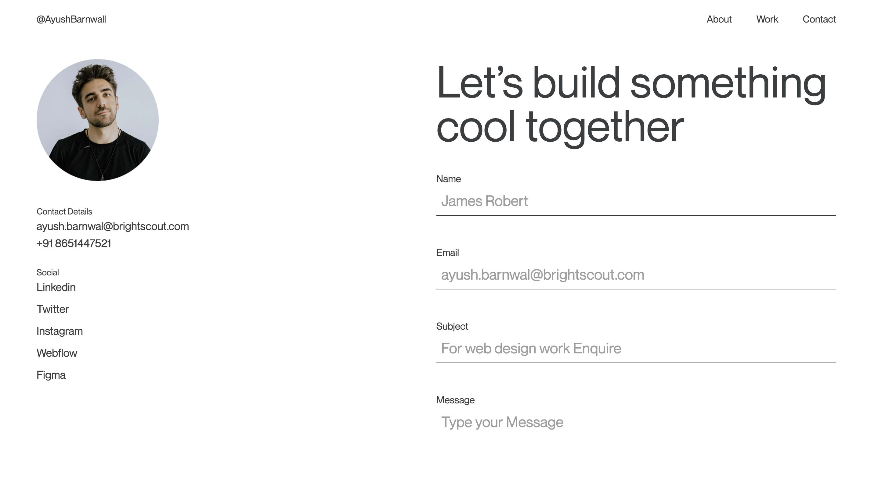

# 🚀 My Profile Website




Figma reference: https://www.figma.com/design/rdUyThdkuA3XXuUwRYuGpN/intro-react?node-id=1-40&t=gvJVwDE6vY8NoNkR-0

## Run Locally

Clone the project

```bash
  git https://github.com/cotbakheu/tugas-4
```

Go to the project directory

```bash
  cd tugas-4
```

Install dependencies

```bash
  npm install
```

Start the development

```bash
  npm run dev
```
